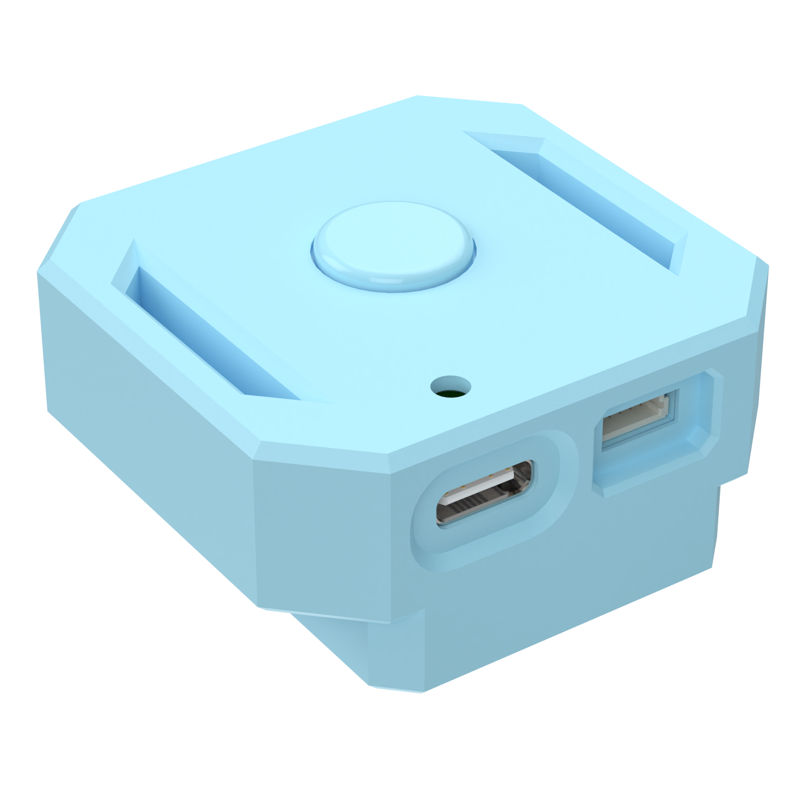
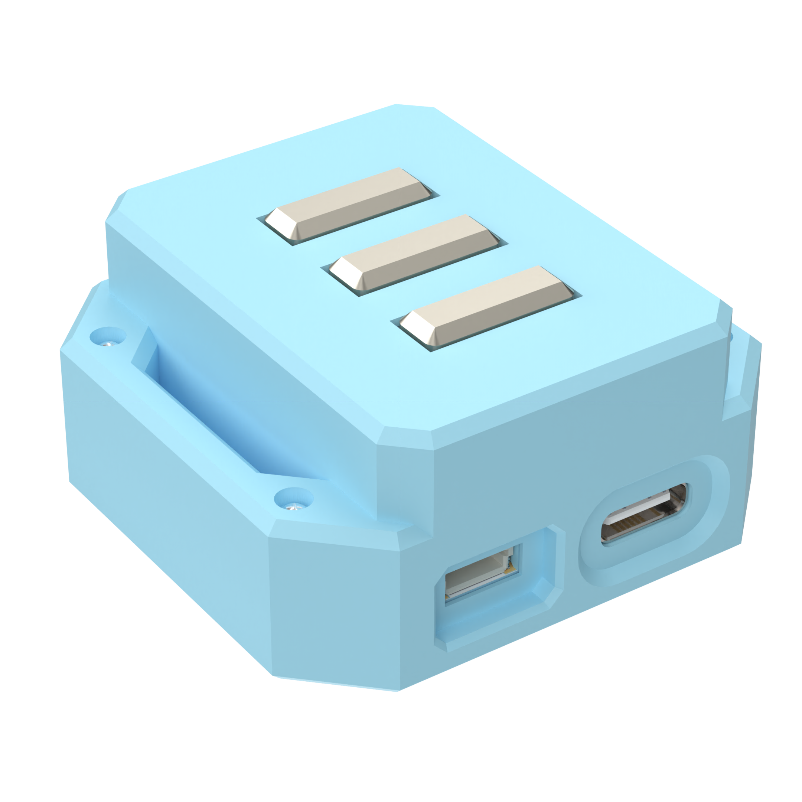
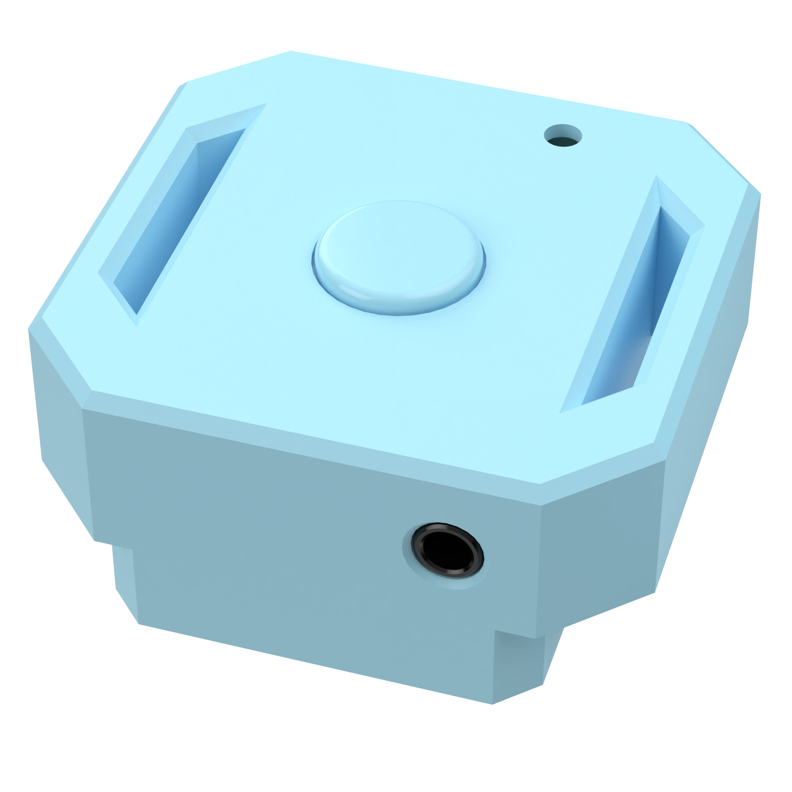

# VEDC.dev

  Vedc v0.1 Front Top product (left), Front Bottom product (right)

  Vedc v0.1 Back Top product (left), Back Bottom product (right)

## Table of contents

- [About](#about)
- [Platform snapshot](#platform-snapshot)
- [Features](#features)
  - [Hardware](#hardware)
  - [Firmware](#firmware)
  - [Software](#software)
- [Environment & build](#environment--build)
- [Writing apps for the Application Manager](#writing-apps-for-the-application-manager)
- [Licence GPL-3.0](#licence-gpl-30)
- [Thanks](#thanks)

## About

VEDC is a wearable biomedical reference design that blends EMG, ECG, and PPG sensing in a developer-friendly package. The hardware stack is fully captured in KiCad, the firmware targets ESP32-PICO-V3-02 via PlatformIO, and all production assets live in this repo so you can reproduce the build or remix it for your own research.

## Platform snapshot

| Item | Detail |
| --- | --- |
| MCU | ESP32-PICO-V3-02 (dual-core Xtensa®, Wi-Fi + BLE, 8 MB flash, 2 MB PSRAM) |
| Sensors | EMG analog front-end, ECG (AD8232), PPG module, 6-axis IMU, magnetometer |
| Connectivity | Wi-Fi 2.4 GHz, Bluetooth v4.2, USB-C (CP2102N), TWAI®/CAN-ready |
| Power | Single-cell Li-Ion + TP4056 charger + XC6220 LDO + smart power-path on MainPCB |
| Target use | Physiology research, medical wearables prototyping, advanced hobby builds |

### Core silicon & companion parts

- ESP32-PICO-V3-02 ([datasheet](https://documentation.espressif.com/esp32-pico_series_datasheet_en.pdf)) with Xtensa® LX6 up to 240 MHz, Wi-Fi/BLE, Ethernet MAC and TWAI®.
- Torex [XC6220B331MR-G](https://www.farnell.com/datasheets/2012852.pdf) 1 A, 3.3 V low-noise LDO for the digital rail.
- Silicon Labs [CP2102N-A02-GQFN28](https://www.silabs.com/documents/public/data-sheets/cp2102n-datasheet.pdf) USB-to-UART bridge for flashing, logging and live telemetry.
- Worldsemi [WS2812B-2020](https://www.mouser.com/pdfDocs/WS2812B-2020_V10_EN_181106150240761.pdf) RGB indicator, Murata [PKMCS0909E4000-R1](https://pim.murata.com/en-us/pim/details/?partNum=PKMCS0909E4000-R1) piezo buzzer, Microchip [MCP3204](https://ww1.microchip.com/downloads/en/devicedoc/21298e.pdf) SPI ADC.
- ST [LSM6DSL](https://www.st.com/resource/en/datasheet/lsm6dsl.pdf) IMU + [LIS3MDL](https://www.st.com/resource/en/datasheet/lis3mdl.pdf) magnetometer for motion/orientation tracking.
- Analog Devices [AD8232](https://www.analog.com/media/en/technical-documentation/data-sheets/ad8232.pdf) ECG AFE and a custom EMG front-end for bio-signal capture.
- TPASIC [TP4056](https://datasheet.lcsc.com/lcsc/1809261820_TOPPOWER-Nanjing-Extension-Microelectronics-TP4056-42-ESOP8_C16581.pdf) charger IC for USB-powered Li-Ion management.

## Features

### Hardware

- Three KiCad projects: EMGSensor, MainPCB, and PPG_V1.0. Each board section includes schematics, PCB layout, manufacturing outputs, notes, and galleries.
- Design focus on low-noise analog front-ends, modular interconnects, and easy probing during validation.
- Production-ready assets: BOM, pick-and-place, netlist, and positional data are stored under every `production/` folder.

[Browse board documentation →](hardware/README.md)

### Firmware

- ESP-IDF/PlatformIO stack targeting ESP32-PICO-V3-02 with FreeRTOS scheduling, NimBLE-based BLE services, USB-UART telemetry, and low-power modes.
- Sensor pipelines for EMG/ECG/PPG including digital filtering, adaptive baseline tracking, and event triggers for motion artifacts.
- Modular drivers housed under `firmware/Embedded/lib/` plus an application layer that streams metrics to BLE characteristics or logs via UART.
- Includes board bring-up helpers (rail monitors, sensor self-tests) and a configurable command shell.

[Read the full firmware guide →](firmware/README.md)

### Software

- Companion tooling (desktop/mobile) is planned to visualize BLE data streams, annotate sessions, and push OTA payloads.
- Current repo includes assets and API constraints so third parties can prototype dashboards or research tools ahead of the official release.
- Planned features: live waveform view, biomarker extraction scripts, and CSV export for MATLAB/Python workflows.

Have tooling to share? Open an issue so we can link it here.

## Environment & build

### Requirements

- VS Code with the PlatformIO IDE extension (or PlatformIO Core CLI).
- Python 3.10+ (PlatformIO manages the toolchain, but Python is still required).
- KiCad 7+ if you plan to edit the hardware.
- Git LFS for large media assets (images/live captures).

### Quick start

1. Clone the repo: `git clone https://github.com/SonDinh23/VEDC.git && cd VEDC`.
2. Open VS Code -> `firmware/` folder -> PlatformIO will auto-configure the environment.
3. Build: `pio run` (or the PlatformIO Build button).
4. Flash: connect the board over USB-C, then `pio run -t upload`.
5. Monitor logs: `pio device monitor` for UART output, or use the BLE explorer of your choice to view live characteristics.
6. Hardware tweaks: jump into `hardware/README.md` to pick the board you want to fabricate or review.

## Writing apps for the Application Manager

- The Application Manager exposes hooks for real-time sensing apps (recording, feedback) and offline routines (log replay, calibration).
- Apps are plain C++ modules that register tasks, BLE endpoints, and menu entries; use the existing patterns under `firmware/Embedded/src/` and supporting libraries in `firmware/Embedded/lib/` as templates.
- Keep apps lightweight: offload heavy analytics to the companion software via BLE or UART streaming.
- Submit a PR or discussion thread before merging new app types so we can document protocol additions for users.

## Licence GPL-3.0

This project is licensed under the GNU GPLv3.  
Compared to permissive licences like MIT, GPLv3 requires that if you modify this code and distribute your version (including in commercial products), you must also release your changes under the same GPLv3 licence and provide the corresponding source code.  

This way, everyone can benefit from improvements built on top of this project.  
If this licence causes issues for your intended use, feel free to contact me – I’m open to discussing alternatives.

## Thanks

Huge thanks to the open-source communities behind ESP-IDF, PlatformIO, KiCad, and the component vendors whose public documentation made reverse-engineering painless. Additional appreciation goes to early testers who provided waveform captures and enclosure feedback. Reach out if you want to be listed here or contribute design critiques.