# 🔧 Hardware Reference

This directory contains the hardware documentation for the VEDC project: schematics, PCB layouts and production files, plus photographic documentation for inspection and review. Each board is described in a self-contained section with: Overview, Quick specs, Key files, Design & test notes, and a photographic gallery.

Navigation

- [EMGSensor](#emgsensor) — electromyography sensor module
- [MainPCB](#mainpcb) — system/mainboard
- [PPG_V1.0](#ppg_v10) — photoplethysmography sensor (prototype)

---

## EMGSensor

Overview

The EMGSensor board acquires surface EMG (electromyography) signals. It conditions microvolt-to-millivolt level signals using a low-noise front-end and band-pass filtering, and provides protection and level conditioning before passing analog outputs to the MainPCB or an external ADC.

Quick specs (typical)

- Signal type: EMG (differential surface electrodes)
- Signal level: microvolts → millivolts (front-end amplification)
- Typical bandwidth: application-dependent; front-end implements band-pass filtering
- Interface: analog outputs to `MainPCB` / ADC

Key files

- `EMGSensor/EMGSensor.kicad_sch` — schematic
- `EMGSensor/EMGSensor.kicad_pcb` — PCB layout
- `EMGSensor/production/` — BOM, placement and netlist files for manufacturing

Design & test notes

- Use short, shielded traces for electrode inputs and maintain a clear analog ground plane.
- Verify input protection and common-mode range before connecting electrodes to live systems.
- Tune filter corner frequencies according to the sampling rate and target EMG bandwidth.

Photographic gallery (EMGSensor)

Figures below use relative paths (from `hardware/README.md`) and include short captions for quick reference.

  <figure style="display:inline-block; width:30%; margin:6px; text-align:center;">
    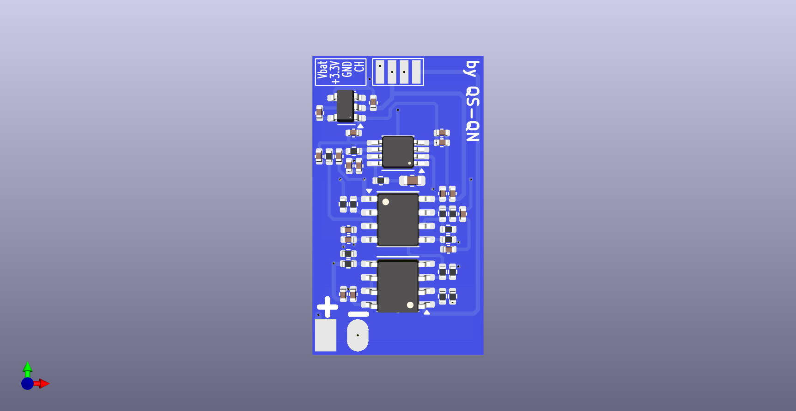
    <figcaption>Top — full module overview</figcaption>
  </figure>
  <figure style="display:inline-block; width:30%; margin:6px; text-align:center;">
    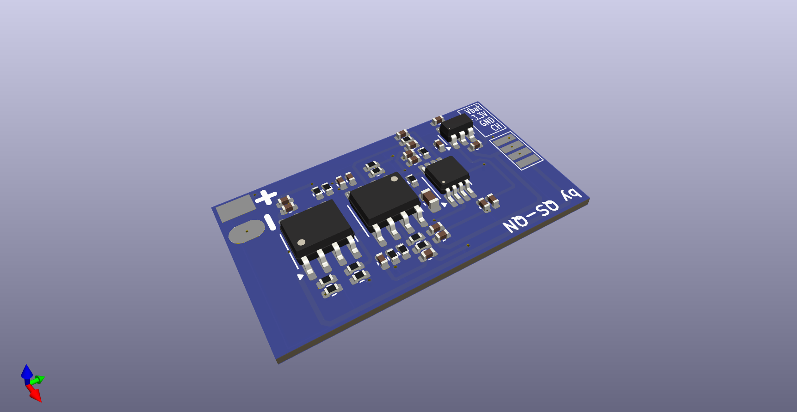
    <figcaption>Top — amplifier/filter area</figcaption>
  </figure>
  <figure style="display:inline-block; width:30%; margin:6px; text-align:center;">
    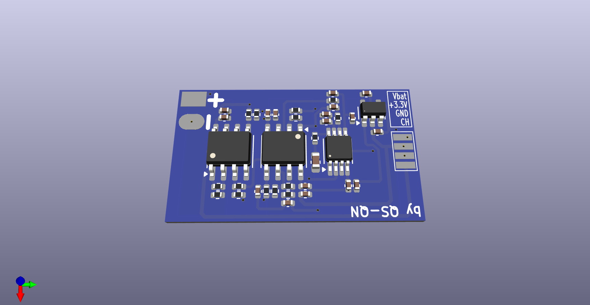
    <figcaption>Top — connector and mechanical features</figcaption>
  </figure>
   
  <figure style="display:inline-block; width:30%; margin:6px; text-align:center;">
    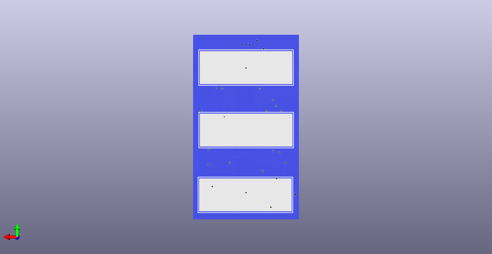
    <figcaption>Bottom — solder side</figcaption>
  </figure>
  <figure style="display:inline-block; width:30%; margin:6px; text-align:center;">
    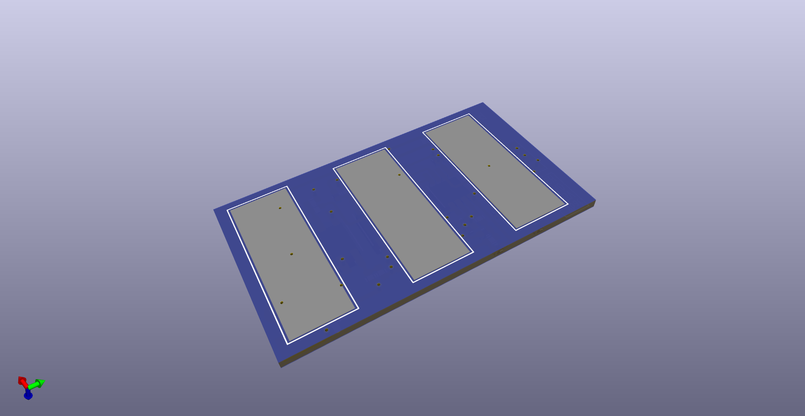
    <figcaption>Bottom — ground pours and vias</figcaption>
  </figure>
  <figure style="display:inline-block; width:30%; margin:6px; text-align:center;">
    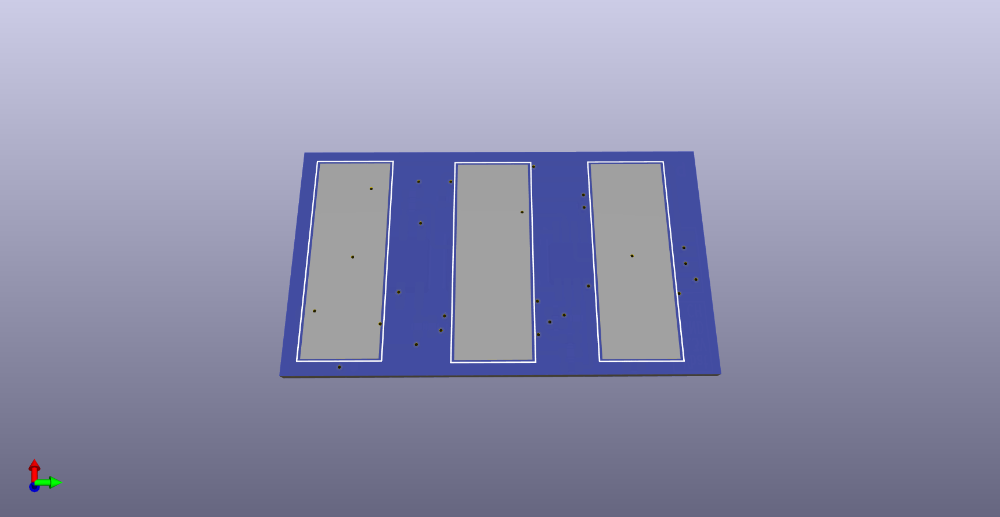
    <figcaption>Bottom — component placement</figcaption>
  </figure>

---

## MainPCB

Overview

MainPCB is the central system board. It supplies regulated power rails, hosts the main processing subsystem (MCU or system module), and provides routing and connectors for sensor modules (EMG, PPG), user interfaces and programming/debugging headers.

Quick specs (typical)

- Role: power distribution, processing, peripheral hub
- Power: battery charging, power-path management, regulated rails (3V3, etc.)
- Interfaces: USB/serial, SPI, I2C, ADC inputs, GPIOs, programming headers

Key files

- `MainPCB/MainPCB.kicad_sch` — schematic
- `MainPCB/MainPCB.kicad_pcb` — PCB layout
- `MainPCB/production/` — BOM, placement and netlist files

Design & test notes

- Review the `production/` BOM and placement files before assembly to confirm component variants and orientation.
- Confirm mechanical mounting and keep-out areas if an enclosure is used.
- Use test points for power rails and critical signals to simplify bring-up and debugging.

Photographic gallery (MainPCB)

  <figure style="display:inline-block; width:30%; margin:6px; text-align:center;">
    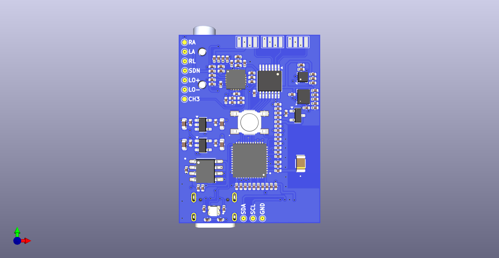
    <figcaption>Top — board overview</figcaption>
  </figure>
  <figure style="display:inline-block; width:30%; margin:6px; text-align:center;">
    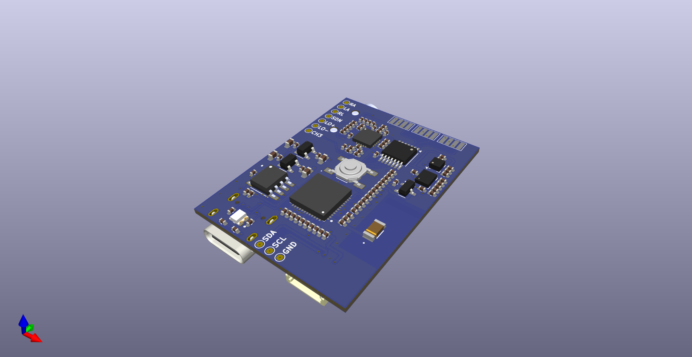
    <figcaption>Top — MCU and connectors</figcaption>
  </figure>
  <figure style="display:inline-block; width:30%; margin:6px; text-align:center;">
    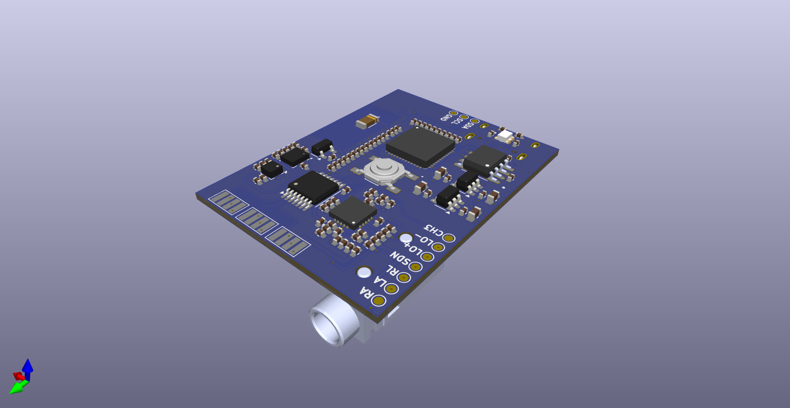
    <figcaption>Top — power subsystem</figcaption>
  </figure>
   
  <figure style="display:inline-block; width:30%; margin:6px; text-align:center;">
    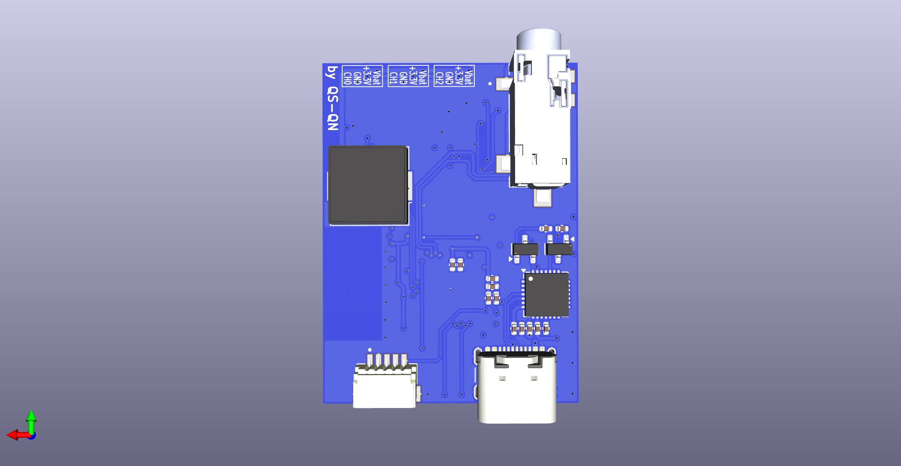
    <figcaption>Bottom — solder side</figcaption>
  </figure>
  <figure style="display:inline-block; width:30%; margin:6px; text-align:center;">
    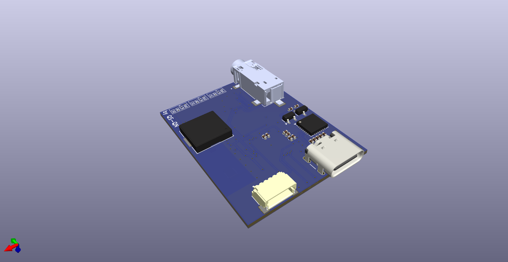
    <figcaption>Bottom — ground pours & routing</figcaption>
  </figure>
  <figure style="display:inline-block; width:30%; margin:6px; text-align:center;">
    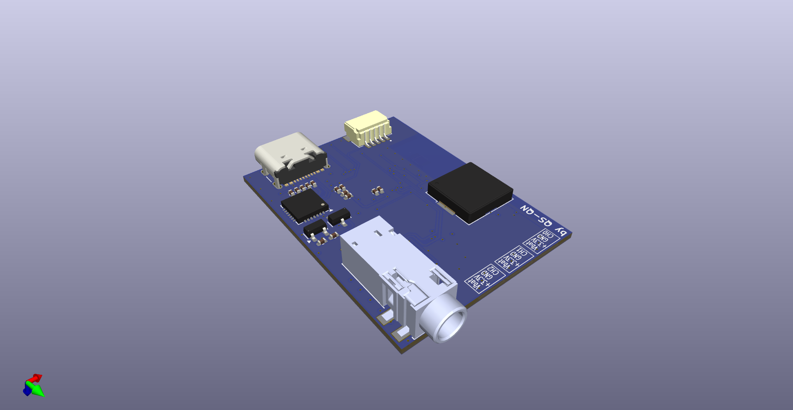
    <figcaption>Bottom — component placement</figcaption>
  </figure>

---

## PPG_V1.0

Overview

The PPG_V1.0 board implements a photoplethysmography sensor. It includes LED drive and a transimpedance amplifier (TIA) to convert the photodetector current to a voltage suitable for digitization.

Quick specs (typical)

- Role: optical heart-rate / blood-volume sensing
- Key blocks: LED driver, photodetector + TIA, analog conditioning
- Interface: analog outputs to `MainPCB` / ADC

Key files

- `PPG_V1.0/PPG_V1.0.kicad_sch` — schematic
- `PPG_V1.0/PPG_V1.0.kicad_pcb` — PCB layout
- `PPG_V1.0/production/` — BOM, placement and netlist files

Design & test notes

- Place LEDs and photodetector to minimize optical crosstalk and maximize contact with tissue.
- Tune LED current and TIA feedback for SNR vs power consumption trade-offs.

Photographic gallery (PPG_V1.0)

  <figure style="display:inline-block; width:30%; margin:6px; text-align:center;">
    
    <figcaption>Top — overview</figcaption>
  </figure>
  <figure style="display:inline-block; width:30%; margin:6px; text-align:center;">
    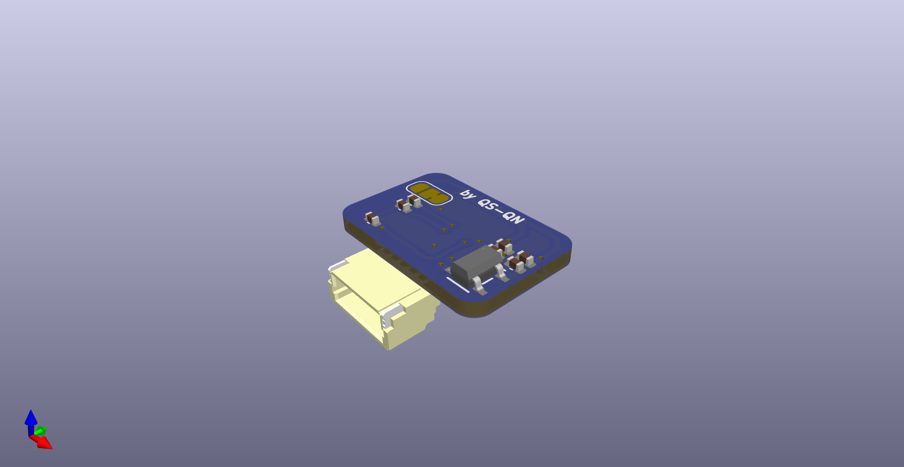
    <figcaption>Top — LED / receiver area</figcaption>
  </figure>
   
  <figure style="display:inline-block; width:30%; margin:6px; text-align:center;">
    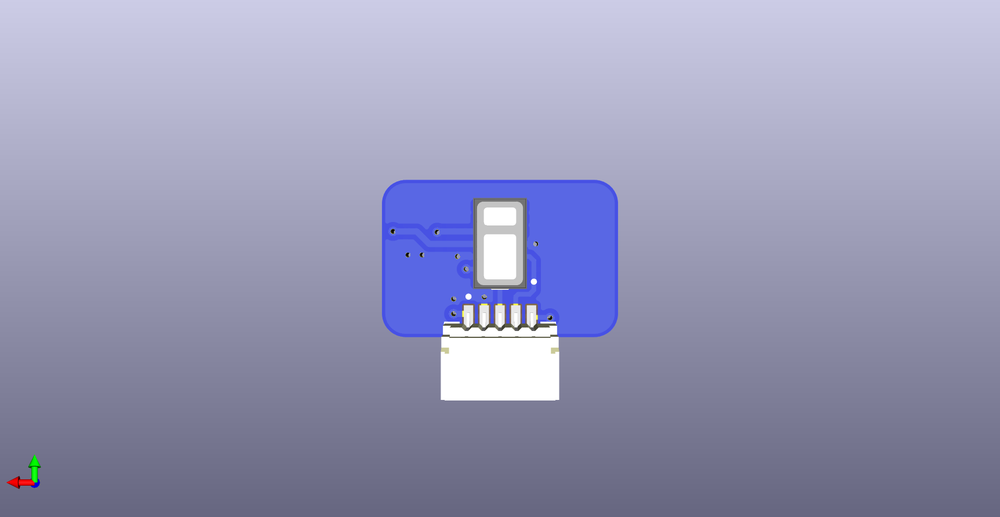
    <figcaption>Bottom — solder side</figcaption>
  </figure>
  <figure style="display:inline-block; width:30%; margin:6px; text-align:center;">
    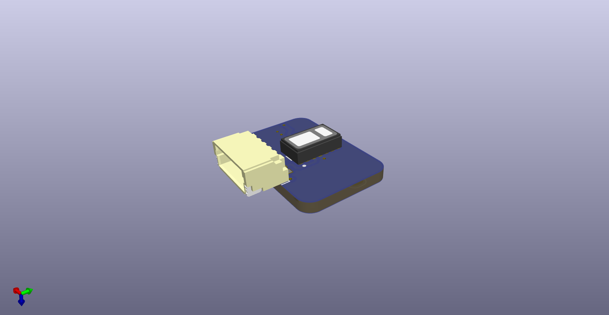
    <figcaption>Bottom — placement view</figcaption>
  </figure>

---

## Notes on images and paths

- Always use forward slashes `/` in image paths; paths in this file are relative to `hardware/README.md`.
- Example: ``
- If images do not display on GitHub, ensure the files are added, committed and pushed to the remote repository.

---

If you prefer additional formatting (one README per board, smaller thumbnails, or a printable table of BOM items), tell me which format you prefer and I'll update accordingly.
